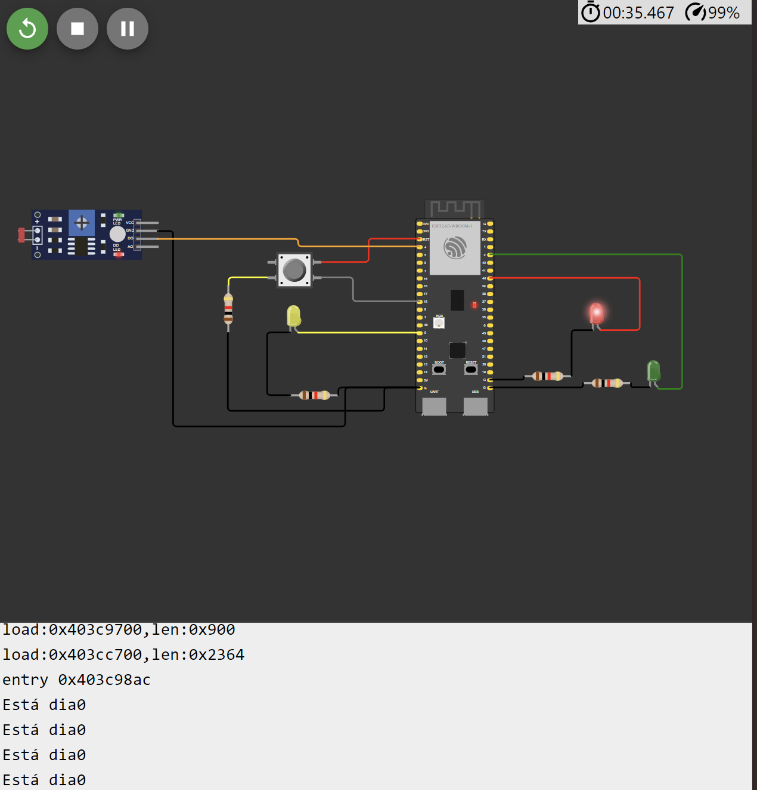
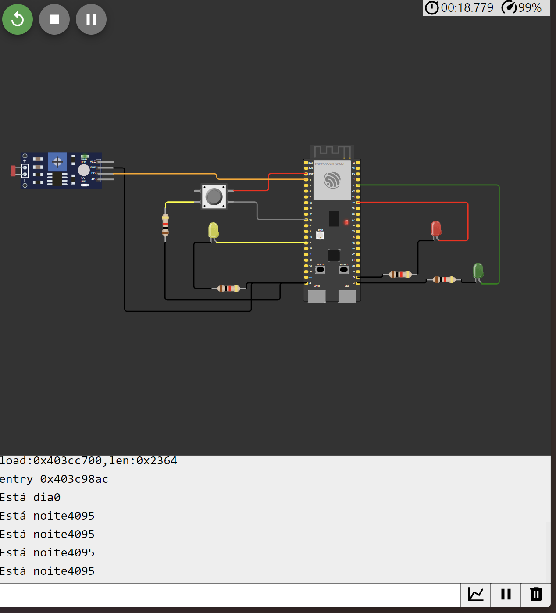

# Features
O sistema conta com um sensor ldr (luz) e possui dois modos principais, o de dia que funciona como um semaforo normal, tendo tempos de 3 segundos para o sinal verde, 2 segundos para o sinal amarelo e 5 segundos para o sinal vermelho. Dentro desse modo temos também um botão que quando acionado enquanto o sinal vermelho está acesso, após 1 segundo o sinal verde se abre.

Figura 1 - Modo de dia 
 

o sistema a noite conta com um semaforo amarelo piscando a cada um segundo, dando passe livre

Figura 1 - Modo noturno 
 

